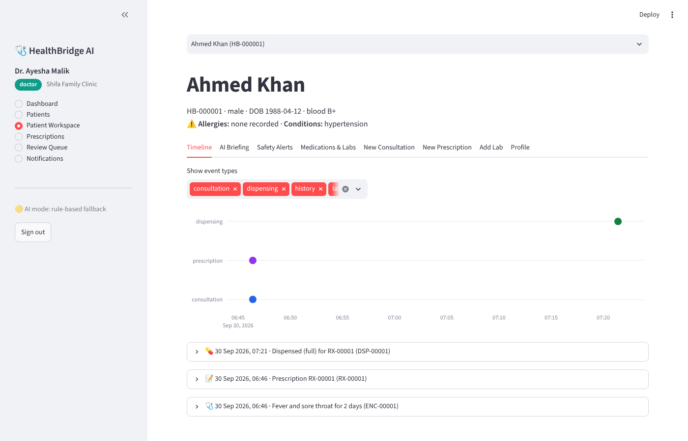
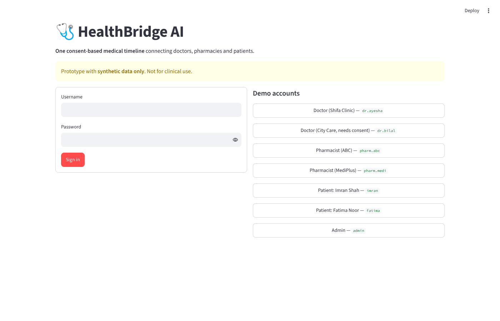
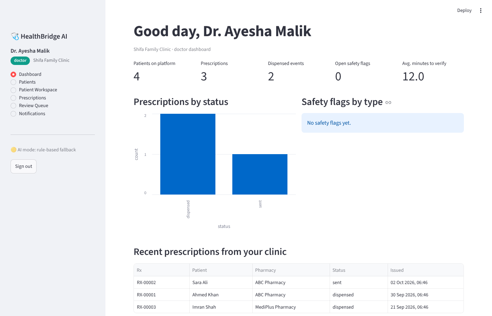

# 🩺 HealthBridge AI

### One consent-based medical timeline connecting doctors, pharmacies and patients.


> ⚠️ **Prototype with synthetic data only.** Not a medical device and not for clinical use. Production use would
> need privacy, security, clinical-governance and regulatory review.



---

## 💡 The idea

Today a patient can visit a clinic, a lab and two pharmacies in one week, and **none of those systems talk to each
other**. The patient ends up carrying paper and acting as the manual bridge between providers.

**HealthBridge AI** is a lightweight interoperability layer for participating clinics and pharmacies. Every
healthcare event, from a consultation to an e-prescription, a pharmacy verification, a dispensing and a lab result,
is added to **one connected patient timeline** that the **patient controls**.

**One-line pitch:** *HealthBridge connects doctors, pharmacies and patients into one consent-based medical timeline,
so the patient no longer has to be the bridge between disconnected healthcare systems.*

### The problem

- Patient records sit in separate clinics, labs and pharmacies, often on paper.
- Doctors may prescribe without the full medication history.
- Pharmacy dispensing is invisible to the prescriber, so nobody knows whether a prescription was filled.
- A medicine whose dose changes between visits (e.g. 500 mg → 1000 mg) can slip through unnoticed.
- Digitising paper archives at scale is hard, so the first step has to be capturing **digital events at the source**.

### The solution

```
Doctor ──► e-prescription ──► Pharmacy: verify / ask / reject ──► full or partial dispensing
   │                                                                          │
   └────────────► ONE connected, consent-based patient timeline ◄─────────────┘
              consultations · prescriptions · dispensing · labs · patient-reported history
                                          │
                  AI briefing + safety flags ──► always reviewed by a human
```

**Our wedge:** the clinic-to-pharmacy prescription and dispensing workflow. From there the platform can grow to labs,
hospitals and other providers.

### Where it fits

Pakistan's national Unified Medical Record / "One Patient, One ID" effort is moving in the same direction. HealthBridge
does **not** try to replace it. It is a practical, standards-friendly layer for participating **private clinics and
pharmacies** today, with a FHIR export as the path to integrate later.

---

## 📸 Screenshots

| Login with demo accounts | Doctor dashboard |
|---|---|
|  |  |

---

## ✨ Features

| Area | What you get |
|---|---|
| **Roles & security** | Doctor, Pharmacist, Patient and Admin roles · JWT login · role-based access control · salted password hashing |
| **Patient registry** | HealthBridge ID (HB-000001), allergies, chronic conditions, optional patient portal login |
| **Consultations** | Structured notes and vitals · optional AI "structure my note" |
| **E-prescriptions** | Multiple medicines, brand-name aware (Panadol → paracetamol), automatic quantity, routed to a chosen pharmacy |
| **Medication safety rules** | Allergy (incl. drug classes) · interactions · duplicate therapy · **strength discrepancy** · max daily dose · kidney-lab caution |
| **Pharmacy workflow** | Inbox · verify / reject / ask for clarification · doctor reply loop · **partial dispensing** |
| **Connected timeline** | Consultations, prescriptions, dispensing, labs and history in one interactive timeline |
| **AI agents** | Record · Prescription · Conflict · Timeline · Pharmacy agents plus an Orchestrator |
| **Traceability** | Every AI statement cites source records (`RX-00007`, `LAB-00002`). Invented IDs are removed. |
| **Consent** | Patient grants and revokes access per doctor, with scope (all / prescriptions / labs) and expiry |
| **Emergency access** | "Break-glass": time-limited, reason required, patient notified, fully audited |
| **Audit trail** | Every access and change is logged. Patients can see *who looked at their data*. |
| **Legacy history (no OCR)** | Patient-typed history labelled **unverified** until a doctor confirms it |
| **FHIR R4 export** | Timeline as a standards-based Bundle |
| **Review queue** | Open safety flags waiting for a clinician. AI can never close a flag. |
| **Works without AI** | No API key? Every feature still works, using rule-based fallbacks |

---

## 🧠 How the AI is used (and limited)

| Agent | Job |
|---|---|
| **Record Agent** | Organises a doctor's free-text note. Adds nothing new. |
| **Prescription Agent** | Describes a prescription and lists points to double-check |
| **Conflict Agent** | Explains each safety flag and asks the clinician a question |
| **Timeline Agent** | Writes a patient briefing with source citations |
| **Pharmacy Agent** | Prepares a verification checklist for the pharmacist |
| **Orchestrator** | Routes work, validates output, falls back to rules, checks citations |

**Guardrails**

- 🛡️ The medication **safety checks are deterministic code, not AI.** The agents only *explain* the flags.
- 🚫 Agents never diagnose, prescribe, change a medicine or close a flag. Humans decide.
- 🔒 Patient name, phone, ID and date of birth are **never sent** to the language model.
- ✅ Every AI answer is validated against a strict schema, and cited record IDs are checked against real records.
- 🏷️ Every AI output is labelled *AI-generated, needs clinician verification*.
- ♻️ If the AI is unavailable, slow or returns invalid output, the app uses a rule-based fallback.

---

## 🏗️ Architecture

```
┌────────────────────────┐   HTTP + JWT    ┌──────────────────────────────────────────────┐
│  Streamlit frontend    │ ──────────────► │  FastAPI backend                             │
│  streamlit_app.py      │ ◄────────────── │  routers → services (rules, access, FHIR)    │
│  frontend/             │      JSON       │              │                               │
└────────────────────────┘                 │              ├─► SQLAlchemy ─► SQLite / PostgreSQL
                                           │              └─► Orchestrator ─► CrewAI agents ─► LLM
                                           │                        └─ rule-based fallback if AI is unavailable
                                           └──────────────────────────────────────────────┘
```

| Layer | Technology |
|---|---|
| Frontend | Streamlit, Plotly, pandas |
| Backend | FastAPI, Uvicorn, Pydantic v2 |
| Database | SQLAlchemy 2 · SQLite (demo) → PostgreSQL (production) |
| Auth | PyJWT, PBKDF2-SHA256 |
| Agents | CrewAI |
| LLM | Any OpenAI-compatible provider. Built and tested for **Grok** (`grok-4.7`) |
| Interoperability | HL7 FHIR R4 (export) |
| Tests | pytest, FastAPI TestClient |

---

## 🚀 Quick start

Requires **Python 3.10 – 3.13** (CrewAI does not support 3.14 yet).

```bash
git clone https://github.com/<your-username>/healthbridge-ai.git
cd healthbridge-ai

python -m venv .venv
```

Activate the virtual environment:

| System | Command |
|---|---|
| Windows (PowerShell) | `.venv\Scripts\Activate.ps1` |
| Windows (Command Prompt) | `.venv\Scripts\activate.bat` |
| macOS / Linux | `source .venv/bin/activate` |

> PowerShell blocking scripts? Run `Set-ExecutionPolicy -Scope CurrentUser -ExecutionPolicy RemoteSigned` once.

```bash
pip install -r requirements.txt

# create your private settings file (Windows: use  copy  instead of  cp)
cp .env.example .env

streamlit run streamlit_app.py
```

Open **http://localhost:8501**. The FastAPI backend starts automatically inside the app, and demo data is created on
the first run. **You do not need an API key to try everything.**

The sidebar shows the AI mode: 🟢 AI connected, or 🟡 rule-based fallback.

### Run the backend separately (optional)

```bash
uvicorn backend.main:app --reload --port 8000        # interactive API docs: http://localhost:8000/docs
API_URL=http://localhost:8000 streamlit run streamlit_app.py     # Windows PowerShell: $env:API_URL="http://localhost:8000"
```

---

## 🔑 Configuring the AI (optional)

Settings live in a file named **`.env`** that you create by copying `.env.example`.

| File | Purpose | Upload to GitHub? |
|---|---|---|
| `.env.example` | Empty template | ✅ yes |
| `.env` | **Your real keys** | ❌ **never** (already in `.gitignore`) |

**Option A: no key.** Leave `XAI_API_KEY=` empty. Everything works with rule-based fallbacks.

**Option B: Grok (xAI).** Paid, see https://console.x.ai.
```
XAI_API_KEY=your-key
XAI_BASE_URL=https://api.x.ai/v1
XAI_MODEL=grok-4.7
```

**Option C: another OpenAI-compatible provider (free tiers exist).** Change the three lines above to your provider's
values, for example Groq, Google Gemini, OpenRouter, or a local Ollama server. Check each provider's docs for the
current base URL, model names and free limits. Smaller models may fail the schema check more often. The app then
falls back to rules, so it never breaks.

Restart the app after editing `.env`.

### 🔒 Keeping your key safe

- Put keys **only** in `.env` (local) or **Streamlit Secrets** (cloud). Never in code, in `.env.example`, in a
  screenshot or in a chat.
- Before pushing: `git status` must not list `.env`, then run `git grep --cached -n "xai-"`, which should print nothing.
- If a key is ever committed, **revoke it immediately** at the provider and create a new one. Deleting the file is not
  enough because Git keeps history.

---

## 🎬 5-minute demo

| Account | Username | Password |
|---|---|---|
| Doctor (Shifa Clinic) | `dr.ayesha` | `doctor123` |
| Doctor (City Care Clinic, needs consent) | `dr.bilal` | `doctor123` |
| Pharmacist (ABC) | `pharm.abc` | `pharma123` |
| Pharmacist (MediPlus) | `pharm.medi` | `pharma123` |
| Patients | `ahmed` `sara` `imran` `fatima` | `patient123` |
| Admin | `admin` | `admin123` |

1. **Happy path.** As `dr.ayesha`, open **Patient Workspace → Ahmed Khan**: consultation → prescription → dispensing.
2. **New patient.** Register one, record a consultation, and send a prescription to **ABC Pharmacy**.
3. **Pharmacy.** Sign in as `pharm.abc`. The prescription is already in the inbox. **Verify**, then **dispense** (try partial).
4. **Patient view.** Sign in as that patient. The timeline shows consultation → prescription → dispensing.
5. **Conflict demo.** As `dr.ayesha`, open **Imran Shah** → *Metformin 1000 mg BD*. A **strength discrepancy** against the
   earlier 500 mg prescription is flagged. Confirm to send, then find it in the **Review Queue**.
6. **Allergy demo.** Open **Fatima Noor** (penicillin allergy, high creatinine) → *Augmentin* (critical allergy flag) or
   *Ibuprofen* (kidney-lab caution).
7. **Consent demo.** `dr.bilal` cannot open Imran. As `imran`, grant Dr. Bilal *labs-only* access under **Sharing & Consent**.
   Bilal now sees only lab events. Revoke it, or try emergency access and check Imran's **Access History**.
8. **AI briefing.** Click **AI Briefing** to see the source-cited summary.

---

## ☁️ Deploy on Streamlit Community Cloud

1. Push the project to a **GitHub** repository (without `.env`).
2. Go to https://share.streamlit.io → **Create app** → pick your repo, branch `main`, main file `streamlit_app.py`.
3. **Advanced settings** → Python **3.12** → **Secrets**:
   ```toml
   SECRET_KEY = "a-long-random-string"
   # optional, to enable the AI agents:
   XAI_API_KEY  = "your-key"
   XAI_BASE_URL = "https://api.x.ai/v1"
   XAI_MODEL    = "grok-4.7"
   ```
4. Click **Deploy**. The backend runs inside the Streamlit app, so one deployment is all you need.

> SQLite on Streamlit Cloud is **temporary**. Data resets when the app restarts, and the demo data is recreated.
> For permanent data, set `DATABASE_URL` to a hosted PostgreSQL (and add `psycopg2-binary` to `requirements.txt`).

**Optional separate backend:** use the included `Dockerfile` / `render.yaml` and set `API_URL` in the Streamlit secrets.

---

## 🧪 Tests

```bash
pip install -r requirements-dev.txt
pytest -v
```

12 tests cover login and roles, the complete doctor → pharmacy → patient workflow (clarification and partial
dispensing included), every safety rule, consent / revoke / break-glass, FHIR export, analytics, and the **CrewAI
pipeline** (using a local fake LLM server, so no API key is needed).

---

## 📁 Project structure

```
healthbridge-ai/
├── streamlit_app.py            # App entry point: login, sidebar, role routing
├── frontend/
│   ├── api_client.py           # HTTP client for the backend
│   ├── backend_runner.py       # Starts FastAPI inside Streamlit (or uses API_URL)
│   ├── ui.py                   # Shared widgets: timeline chart, alert cards, AI banner
│   └── views/                  # doctor.py · pharmacist.py · patient.py · admin.py
├── backend/
│   ├── main.py                 # FastAPI app
│   ├── config.py · database.py · models.py · schemas.py · security.py · audit.py
│   ├── serializers.py · seed.py
│   ├── routers/                # auth · patients · prescriptions · timeline · consent · admin · ai
│   ├── services/               # drug_data · conflict_rules · access · timeline_service · fhir
│   └── agents/                 # llm · output_models · crew_agents · orchestrator · fallbacks
├── tests/                      # conftest · test_workflow · test_crewai_agents
├── docs/                       # CODE_GUIDE.md (every file explained) · images/
├── requirements.txt · requirements-dev.txt · Dockerfile · render.yaml · .env.example
└── .streamlit/                 # config.toml · secrets.toml.example
```

New to the code? Read **[docs/CODE_GUIDE.md](docs/CODE_GUIDE.md)**. It explains every file step by step.

---

## 🗺️ Roadmap

| Version | Focus |
|---|---|
| **V0 (this repo)** | End-to-end workflow, agents, consent, audit, FHIR export |
| **V1: Pilot** | PostgreSQL, stronger auth (MFA), real accounts, SMS/WhatsApp notifications, admin console |
| **V2: Interoperability** | Full FHIR APIs, standard vocabularies (RxNorm / LOINC), clinic, lab and pharmacy integrations |
| **V3: Document intelligence** | OCR for paper records with a human-verification queue |
| **V4: Network platform** | Multi-tenant scale, patient mobile app, referrals, national UMR integration |

## ⚠️ Limitations

- The drug-safety list in `drug_data.py` is a small **demo set**, not a licensed clinical database.
- No identity-provider integration, MFA, encryption at rest or regulatory compliance work has been done.
- Paper-record OCR is intentionally out of scope for this version.
- Not a replacement for national UMR infrastructure.

## 📚 Research behind the idea

The problem statement draws on these sources, as cited in the project's requirements document:

1. Khan, W.A. (2026). *Towards Connected Care: Why Pakistan Needs Integrated Electronic Health Records.* JCPSP 36(5), 677–679. DOI: 10.29271/jcpsp.2026.05.677
2. *Health data ecosystem in Pakistan: a multisectoral qualitative assessment of needs and opportunities.* BMJ Open (2023). DOI: 10.1136/bmjopen-2023-071616
3. Government of Pakistan, PID (12 June 2025). *Federal Ministers Review Progress on 'One Patient, One ID' Initiative.*
4. Pakistan Digital Authority / MoNHSR&C (18 Sept 2026). *Progress on Medical Record, Health Complaint Management System and HMIS-SAP.*
5. Pakistan Digital Authority (20 Aug 2026). *Pakistan's Health Sector Sets Its Digital Priorities.*
6. Government of Pakistan, PID (6 Jan 2026). *Pakistan Launches First Digital First BHU in Gokina, Islamabad.*

## 👤 Author

Built by **<your name>** for **<hackathon / course name>**. Questions and ideas are welcome via GitHub Issues.

## 📄 License

Add a license of your choice (for example MIT) before publishing.
